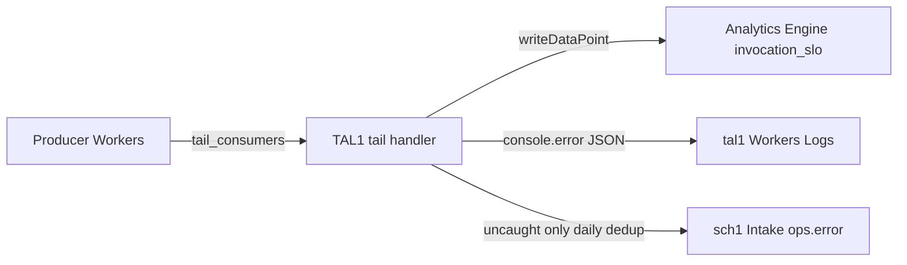

# TAL1

Central [Tail Worker](https://developers.cloudflare.com/workers/observability/logs/tail-workers/) that:

1. Writes **invocation-level** samples to [Workers Analytics Engine](https://developers.cloudflare.com/analytics/analytics-engine/) (`invocation_slo`)
2. Aggregates **uncaught exceptions** (source-mapped stacks when producers set `upload_source_maps = true`) into **tal1 Workers Logs** and sch1 Intake

Producer Workers only add `[[tail_consumers]]` — they do **not** need their own Analytics Engine binding for the SLO layer.

## What it does



### Analytics Engine (`invocation_slo`)

After each producer invocation, TAL1 writes **one** data point:

| AE column | Meaning |
|-----------|---------|
| `index1` | Producer `scriptName` |
| `blob1` | `outcome` (`ok`, `exception`, `exceededCpu`, `canceled`, …) |
| `blob2` | HTTP method; `unknown` for cron / queue / email (no fetch URL yet) |
| `blob3` | First two path segments (query stripped), max 256 chars |
| `double1` | `cpuTimeMs` |
| `double2` | `1` if `outcome === "ok"`, else `0` |
| `double3` | `wallTimeMs` |

**Not in AE:** `console.log` bodies, headers, stack traces, or request URLs with query strings (cardinality / PII).

### Exception hub (Logs + Intake)

| Signal | tal1 Workers Logs | sch1 Intake |
|--------|-------------------|-------------|
| Uncaught `exceptions[]` (remap after `upload_source_maps`) | JSON `msg=tal1_exception` | `ops.error` / `reason=uncaught_exception`（按日去重；**不发邮件**） |
| Caught `logs[].errorInfo` | same JSON with `errorInfo` | **否**（避免与业务 `reportOpsError` 重复） |

Requires `SVC_SCH1` + `SCH_INTAKE_TOKEN`（Secrets Store）。Missing bindings → intake warn, tail still succeeds.

**Not a replacement** for business SLO metrics (`kind`, `because`, per-route latency on hot paths). Use explicit `writeDataPoint` in application code or OTEL export for that.

**Note:** `outcome` is Workers exit status, not HTTP status. A `400` response can still be `ok`.

## Requirements

- Cloudflare Workers **Paid** or Enterprise (Tail Workers)
- Tail Worker billed by **CPU time**, not request count
- Producers: `upload_source_maps = true` so uncaught stacks remap to TypeScript

## Deploy

1. Clone and install:

```bash
npm install
npm test
npm run check
```

2. Set `name = "tal1"` in `wrangler.toml` (CF script name, lowercase). Producers must use the **same** script name in `tail_consumers`.

3. Deploy the tail worker **before** producers:

```bash
npx wrangler deploy
```

4. On each producer `wrangler.toml`:

```toml
upload_source_maps = true

[[tail_consumers]]
service = "tal1"   # must match tail worker CF script name
```

Do **not** add `tail_consumers` on the tail worker itself (no self-tail).

## Query example

[Analytics Engine SQL API](https://developers.cloudflare.com/analytics/analytics-engine/sql-api/):

```sql
SELECT
  index1 AS script,
  blob1 AS outcome,
  SUM(_sample_interval) AS n,
  SUM(_sample_interval * double3) / SUM(_sample_interval) AS avg_wall_ms
FROM invocation_slo
WHERE timestamp >= NOW() - INTERVAL '1' DAY
GROUP BY script, outcome
ORDER BY n DESC
```

## Local development

`wrangler dev` has limited `tail()` coverage. Mapper / exception hub logic is covered by Vitest (`test/trace-to-point.test.ts`, `test/exception-hub.test.ts`).

## Architecture notes

See [docs/architecture.md](docs/architecture.md) for design boundaries, cost, and what we intentionally do not do.

## Related Cloudflare docs

- [Tail Workers](https://developers.cloudflare.com/workers/observability/logs/tail-workers/)
- [tail() handler](https://developers.cloudflare.com/workers/runtime-apis/handlers/tail/)
- [Source maps and stack traces](https://developers.cloudflare.com/workers/observability/source-maps/)
- [Exporting OTEL](https://developers.cloudflare.com/workers/observability/exporting-opentelemetry-data/) — alternative if you need batch export to Grafana/Honeycomb without custom tail code
